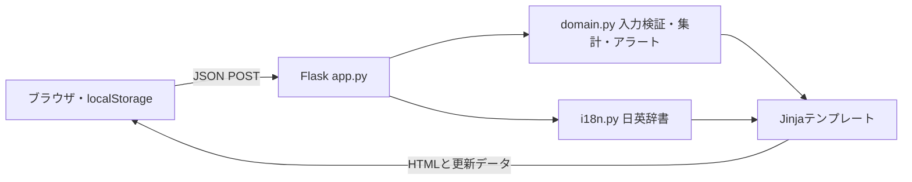

# MAISON 顧客管理アプリ設計書 — Python版

更新日：2026-10-02 / 制作者表示：ウィン（Win）

## 1. 目的と範囲

販売スタッフの連絡忘れ・返信忘れを、担当顧客一覧の色とラベルで見つける。1店舗・10名を想定し、まずウィンが使うポートフォリオとする。2店舗目は切替の見た目とデータ分離を示すデモ。認証や実際のテナント分離、通知、LINE送受信、Teams取込は対象外。

Python課題の詳細条件は未提示のため、Flask利用可能・日本語と英語の2言語を前提とした。Next.js版からPythonを中心に再実装した。

## 2. 画面と操作

| 画面 | 内容 |
|---|---|
| ダッシュボード | 担当顧客数、要対応、未返信、当日対応の集計と優先顧客 |
| 顧客一覧 | 名前・商品・会話検索、担当・段階・対応状況の絞込、優先度等のソート |
| 商談ボード | 来店→商品提案→検討中→再来店→購入→購入後フォロー |
| 顧客詳細 | プロフィール編集、会話履歴、送信・受信・接客・メモ記録、次回日付 |
| フォローアップ | 連絡が必要な顧客を抽出 |
| 対応履歴 | 店舗内の会話履歴 |
| スタッフ | 10名の担当状況から担当一覧へ移動 |
| 設定・連携 | 店舗・言語・LINEプレビュー・デモリセット |

LINEの受信と送信は手動記録。メッセージは実際には送信されない。データを初期化する前には確認画面を表示する。

## 3. アラート規則

日本時間の当日を基準に、上から最初に一致する条件を採用する。

| 優先 | 条件 | 表示 |
|---|---|---|
| 1 | 最新のメモ以外の記録が受信 | 赤：返信が必要 |
| 2 | 次回フォロー日が今日より前 | 赤：連絡期限超過 |
| 3 | 次回日が今日・明日、または最終連絡から14日以上 | 琥珀色：連絡推奨 |
| 4 | 最終連絡が今日 | 緑：対応済み |
| 5 | その他 | 中立色：フォロー予定 |

優先度ソートでは要返信→超過→推奨→予定→対応済みの順。過去日の送信を追加しても、それより新しい受信は未返信のまま。メモだけでは連絡日・未返信を変えない。同日内の記録は後から追加したものを最新として扱う。色だけに頼らずラベルを併記する。

## 4. データ設計

顧客：ID、店舗ID、担当スタッフ、氏名、読み方、電話、メール、誕生日、サイズ、興味商品、購入メモ、個人メモ、顧客区分、商談段階、次回フォロー日、最終連絡日、未返信フラグ、連絡履歴。

連絡履歴：ID、日付、種別、内容。入力検証はPython側で行い、必須氏名・本文、日付形式、選択値、文字数、未来日の連絡記録などを確認する。架空のサンプル文字列は日英辞書を持つ。ユーザーが入力した文章はそのまま保存し、自動翻訳しない。

## 5. 構成と通信

| エンドポイント | 用途 |
|---|---|
| GET / | 初期画面をサーバー生成 |
| POST /api/workspace | 絞込・登録・編集・記録・リセット、画面生成 |
| POST /api/dialog | 顧客詳細・新規・連携プレビュー等の生成 |
| GET /api/health | Python/Flask稼働確認 |
| /assets/* | CSS・JS・favicon。Vercelではpublicから配信 |

ブラウザは最新の顧客データをリクエストで渡し、Pythonが処理する。DBを用いないステートレス構成のためVercelの実行環境再起動でもブラウザ内のデータは維持される。操作にはサーバー通信が必要。端末間・ブラウザ間の共有はなく、ブラウザ保存削除で変更は消える。最大300顧客・顧客ごと500履歴・リクエスト2MBのデモ制限。

旧版の保存領域は上書きしない。Python版は `maison-python-v2` に保存し、旧版からの移行機能は持たない。Supabaseは未使用。SQL案は将来の参考資料で、現行実装に接続していない。

## 6. 見た目・多言語・スマホ

濃いブラウン、キャメル、クリームを基本色に、セリフ体の見出しと旅行鞄を思わせる装飾を組み合わせる。ブランド公式ロゴは使用せず独自名MAISONで表現する。

日英をヘッダーで切替。ナビ・見出し・状態・フォーム・サンプル会話を切替え、選択はブラウザに保存する。ウィン／Win表記も連動する。

760px以下では表をカードに切替え、下部に主要ナビを固定。詳細・入力は下から開くダイアログ、主要操作は44px以上、入力は16px。スタッフ・履歴はスマホの設定画面からもアクセスできる。

## 7. 検証とデプロイ

Python unittestで日付の境界、優先度、受信・送信・メモ、過去日入力、検証エラー、日英全画面、登録・編集、店舗絞込、HTMLエスケープを確認する。ブラウザで登録、言語切替、再読込、390px画面と入力フォームを確認する。

GitHub mainへのpushでVercelへ自動デプロイ。公開後にhealthと画面を確認する。運用用の認証・DB・LINE APIは本課題の対象外。

参考：[VercelのFlask対応](https://vercel.com/docs/frameworks/backend/flask)
