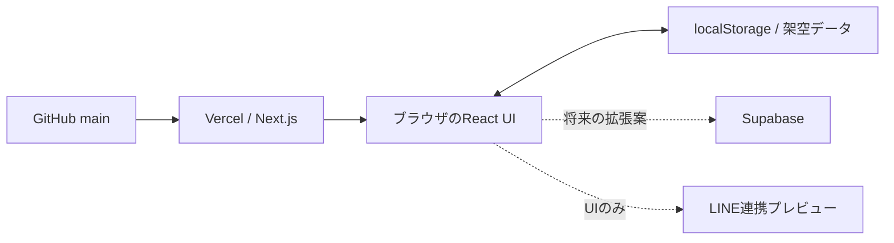

# MAISON 顧客フォロー管理 — 設計書

作成日：2026年10月2日 / バージョン：1.0 / 用途：ポートフォリオ

## 1. 目的と決定事項

担当顧客との会話と次回アクションをまとめ、連絡忘れ・返信忘れに一覧の色で気づけるようにする。接客中でも顧客の好みや直近の連絡を短時間で確認できることを優先する。

当初の設計書のみの依頼から、ユーザーの追加指示により「実装・GitHubプッシュ・Vercel公開」までを今回の範囲に変更した。

| 項目 | 確定内容 |
| --- | --- |
| 利用規模 | 初期は本人1名、画面は10名のスタッフを想定 |
| 店舗 | メイン1店舗、別店舗への切り替えは見た目のデモ |
| 現行運用 | 会社支給端末のLINE、Teamsなどに分散した顧客メモ |
| 連携 | LINEは説明・未接続UIのみ。認証、会話取得、送受信なし |
| アラート | 顧客一覧の色と文字。外部通知なし |
| 利用データ | すべて架空。Teamsからの取り込みなし |
| 運用機能 | 本番向け認証・監査・マルチテナント認可は対象外 |
| 保存 | ブラウザlocalStorage。他のブラウザや端末とは共有しない |

店舗名・スタッフ名はデモ用に設定。銀座店20名、大阪店5名の計25名の顧客を用意する。高橋美咲を初期表示の担当者にし、銀座店では9名を担当する。スタッフ選択で全員・個人を切り替える。

## 2. 体験と画面

1. ダッシュボードで担当顧客数、要連絡数、要返信数、本日の対応済み数を見る。
2. 「連絡が必要」または「今日のひと声」から顧客ノートを開く。
3. 過去の会話・興味商品・接客メモを確認する。
4. 実際の連絡は既存の業務手段で行い、デモ内には対応を手入力する。
5. 次回フォロー日と商談ステータスを更新する。
6. 一覧のアラートと集計に反映され、ブラウザ内に保存される。

| 画面 | 主な内容と操作 |
| --- | --- |
| 共通サイドバー | 店舗選択、画面移動、本人プロフィール、LINE連携案内 |
| ダッシュボード | 4つの集計カード、要対応顧客、優先度順の今日のフォロー |
| 顧客一覧 | 氏名・商品・直近メッセージの検索、担当者と商談ステータスで絞り込み、優先度／名前／予定日のソート |
| 商談ボード | 6ステータス別のカード表示。カードから顧客ノートを開く。ドラッグ移動は対象外 |
| フォローアップ | 赤・琥珀色に該当する顧客の一覧 |
| 顧客ノート | 対応記録、次回日付、商談ステータス、履歴タイムライン、プロフィール編集 |
| 新規顧客登録 | 氏名、フリガナ、電話、メール、興味商品、担当スタッフ、次回日付、メモ |
| 対応履歴 | 選択店舗・担当者の記録を日付降順で表示 |
| スタッフ | 10名のカード、担当数・要連絡数、そのスタッフの顧客への遷移 |
| 設定・連携 | 店舗切り替え、LINE UI、ルール説明、初期データへのリセット |

モーダルはEsc・閉じるボタン・背景クリックで閉じる。ネイティブdialogでフォーカスを制御する。スマートフォンではメニューを折り畳み、集計カードは2列、一覧は横スクロールとする。

## 3. 商談とフォローの状態

商談ステータスは「来店 → 商品提案 → 検討中 → 再来店 → 購入 → 購入後フォロー」。これは想定する順序であり、デモでは直接選択して変更できる。ステータスと連絡アラートは別の値として扱う。

今日の日付はAsia/Tokyo基準。初期データの日付は初回アクセス日からの相対日数で生成し、以後は保存された実日付を使用する。開いたまま日付が変わった場合は再読み込みで更新する。

| 優先順位 | 条件 | 表示 |
| --- | --- | --- |
| 1 | 最新の連絡記録が受信で、未返信 | 赤・返信が必要 |
| 2 | 次回フォロー日が今日より前 | 赤・連絡期限超過 |
| 3 | 次回フォロー日が今日または明日、または最終連絡から14日以上 | 琥珀色・連絡推奨 |
| 4 | 今日の連絡記録があり、上の条件に該当しない | 緑・対応済み |
| 5 | その他 | グレー・フォロー予定 |

複数の条件を満たす場合は上の条件を優先する。例えば今日返信しても次回日付を過去のままにした場合は期限超過が残る。「対応済み」タブと集計は緑の判定と一致させる。

記録種別は送信・受信・接客・メモ。メモは最終連絡日と未返信状態に影響しない。連絡日は未来日を入力不可とし、日付降順の最新の連絡から未返信状態を判定する。同日の記録は新しく入力したものを先頭にする。過去の記録を追加しても、新しい受信に対する返信待ちを消さない。

## 4. データモデル

現行のデモはCustomer配列にActivity配列を内包する。IDは初期データでは固定文字列、新規作成ではUUID。localStorageキーは `maison-clienteling-v1`、保存内容は `{version:1, customers:[...]}`。

| Customer項目 | 型・用途 |
| --- | --- |
| id / store / staff | 顧客ID・店舗ID・担当者名 |
| name / kana | 氏名・フリガナ |
| email / phone / birthday / size | メール・電話・誕生日・サイズ |
| tier / interests | 顧客区分と興味商品配列 |
| stage | 6つの商談ステータス |
| lastContact / nextDate | 最終連絡日・次回フォロー日（YYYY-MM-DD） |
| pendingReply | 未返信の受信があるか |
| note / purchase / total | 接客メモ・購入履歴テキスト・初期データの参考購入額。購入額は画面に使用しない |
| activities | 対応記録配列 |

Activityはid・date・type・textを持つ。記録本文は最大2,000文字。氏名は最大80文字。保存できないブラウザでは画面内の変更は続けられるが、保存失敗を表示する。破損した保存データは、基本的なスキーマチェックで検出できる場合に初期データへ戻す。

将来のDB案は stores → staff → customers → activities。担当変更でも履歴を保持できるよう、顧客と対応履歴を分離する。参考SQLは `schema-proposal.sql`。現行アプリとは未接続で、投入・実機検証も行っていない。

## 5. 技術構成

Next.js App Router、React、TypeScript、Lucideアイコン、通常のCSSを使用。動的な操作はClient Componentで処理する。API・環境変数・秘密鍵は不要。Google FontsのCormorant GaramondとNoto Sans JPを使用し、取得できない場合はシステムフォントへフォールバックする。

リポジトリ： https://github.com/shweyikyiwin5898-star/sales-management-tool

Vercelでは `vercel.json` でNext.jsを指定し、mainへのプッシュでビルドする。非公式のポートフォリオであることを設定画面・READMEに明記する。

Supabaseの連携ツールは利用可能だが、確認時点でプロジェクトは0件だった。見た目を優先する要件と、不要なクラウドリソース作成を避けるため、今回のアプリはDBなしで完結させた。SQL投入は未実施。SQLは将来の移行資料であり、公開APIや認証機能の実装を約束するものではない。

## 6. ビジュアル仕様

- アイボリー `#f7f6f2`、白いカード、深いブラウン `#332e28`、控えめなゴールド `#a38b5e`。
- 赤 `#b05e57`、琥珀 `#ac833d`、緑 `#668272`。色に加えて文字ラベルと行の左端で状態を表す。
- 英字ブランドはセリフ体、本文と日本語UIはゴシック体。
- 一覧と余白を主役にし、過剰な装飾や顧客写真は使わない。
- MAISONは架空のコンセプト名。Louis Vuittonのロゴや公式素材は使わない。

## 7. 受け入れ条件

- 初回に架空の25顧客と10スタッフが表示される。
- 店舗・担当者・検索・商談ステータスの条件で一覧が絞り込める。
- 未返信、期限超過、連絡推奨、対応済みの表示と集計が一致する。
- 顧客登録・プロフィール編集・連絡記録・次回日付変更が保存される。
- ページ再読み込み後も同じブラウザでは変更が残る。
- LINE画面でデモであることが明確で、認証や送信処理を呼ばない。
- モバイル幅で主要操作を使え、ページ全体が横に溢れない。
- TypeScriptチェックと本番ビルドが成功し、公開URLが表示される。

## 8. 対象外と拡張

店舗間の切り替えは表示のフィルタであり、実際のマルチテナント認可ではない。ログイン、通知、LINE接続、Teamsからの自動取り込み、スタッフ間共有、同時編集、バックアップは実装しない。ブラウザのデータ消去で変更が失われる。

将来、実用化する場合の追加設計は、Supabase Authとテナント別権限、DBへの保存、LINE公式アカウント等の利用方式、履歴移行を別途扱う。通常の会社支給端末のLINEをそのままMessaging APIへ接続できるとは想定しない。

今回のアプリによるLINE API費・DB利用費は発生しない。ホスティング費はVercelアカウントの契約・利用量に依存し、本作業では有料プランへの変更を行わない。

## 9. 参照資料

- [Next.js Installation](https://nextjs.org/docs/app/getting-started/installation)
- [Vercel Project Configuration](https://vercel.com/docs/project-configuration)
- [Supabase Data API Security](https://supabase.com/docs/guides/api/securing-your-api)
- [LINE Messaging API overview](https://developers.line.biz/en/docs/messaging-api/overview/)

資料確認日：2026年10月2日。今回の実装・未実装の境界は上記仕様を正とする。
